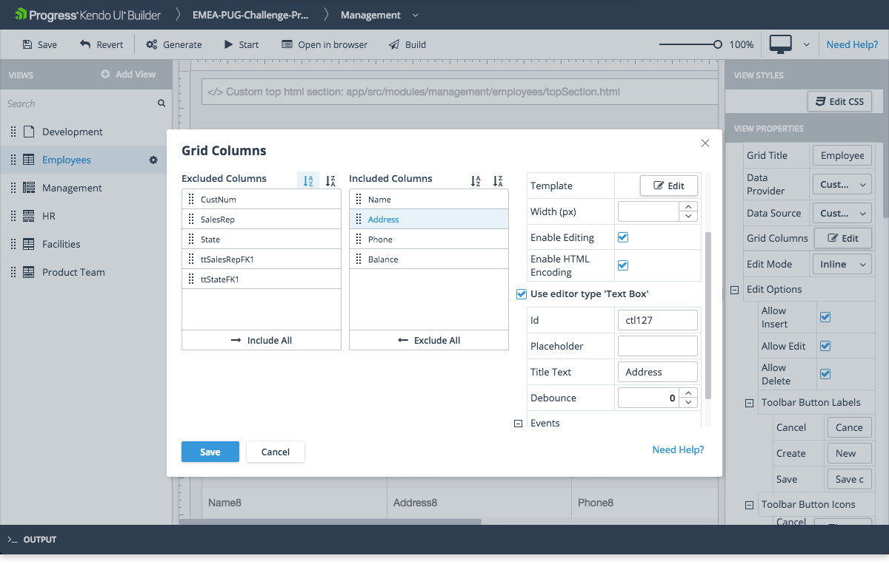

# Grid

The Grid is part of the Data Management components which the Builder supports.

## Usage

* Displays data in a tabular format.
* Provides configuration options for managing the rendered data such as editing, filtering, grouping, and sorting.

## Properties of Interest

* **Columns**&mdash;Represents a list with grid columns. After selecting the value in data-source combo box, the columns collection will be automatically populated based on the fields metadata in the selected data source. Since the **Columns** property is a collection, the Builder uses a special editor for it which is opened when the user clicks the **Edit** button of the **Columns** property. In the property editor, you can include or exclude columns and the following columns properties:
    * Use the **Include all** and **Exclude all** buttons to move the entire list of fields back and forth between the **Included Fields** and **Excluded Fields** lists.
    * **Template**&mdash;Represents the template which will be rendered in the column content. For more information, refer to the Kendo UI for jQuery documentation on the [AngularJS integration](https://docs.telerik.com/kendo-ui/api/javascript/ui/grid/configuration/columns.template) or to the [Kendo UI for Angular documentation](https://www.telerik.com/kendo-angular-ui/components/grid/columns/templates/).
    * **Enable HTML Encoding**&mdash;If set to `true`, the column value will be HTML-encoded before it is displayed. If set to `false`, the column value will be displayed as is. By default, the column value is HTML-encoded.
    * **Use Editor type '[Component Name]'**&mdash;When you define your data source with fields, each field has an auto-selected **Editor Type** that is based on the underlying data type. You can change this behavior in the [**Edit Data Source** window of the respective data provider](). Based on this edit type, the Grid will render a corresponding component when it is set in edit mode. In this case, the components are the same components which are exposed for dragging and dropping in the Blank view. When the checkbox is checked, the corresponding component properties can be changed from the property grid on the right side. If this checkbox is not selected, the Grid will use the built-in editors.

    

* Events
    * **Row Select Event Function**&mdash;Represents a function that runs when a Grid row is selected by the user.
    * **Row Create Event Function**&mdash;Represents a function that runs before a row is created for a new data source record.
    * **Row Update Event Function**&mdash;Represents a function that runs before an existing data source record is updated in the row.
    * **Row Delete Event Function**&mdash;Represents a function that runs before an existing data source record is deleted in the row.
    * (AngularJS only) **Data Bound Event Function**&mdash;Represents a function that runs when the Grid is bound to its data source. You have to include any custom code for this event function in the `controller.public.js` file for AngularJS or in the `[view-name].view.component.ts` file for Angular which are located in the `\app\src\modules\[module-name]\[view-name]` folder. For more information, refer to the article on [custom code]().
    * (AngularJS only) **Row Template Function**&mdash;Represents a function that returns the HTML for a Kendo UI [`rowTemplate`](https://docs.telerik.com/kendo-ui/api/javascript/ui/grid/configuration/rowtemplate). If specified, the row template is used to format all the rows in the Grid unless you also define an `altRowTemplate`.
    * (AngularJS only) **Row Template Id**&mdash;Represents the ID of an HTML `rowTemplate`. If specified, the `rowTemplate` must be defined in the `\app\src\modules\[module-name]\[view-name]\topSection.html` file. If both a **Row Template Function** and a **Row Template Id** are specified, the **Row Template Id** takes precedence.
    * (AngularJS only) **Alt Row Template Function**&mdash;Represents a function that returns the HTML for a Kendo UI [`altRowTemplate`](https://docs.telerik.com/kendo-ui/api/javascript/ui/grid/configuration/altrowtemplate). If specified, the `altRowTemplate` is used to format every other row in the Grid.
    * (AngularJS only) **Alt Row Template Id**&mdash;Represents the ID of an HTML `altRowTemplate`. If specified, the `altRowTemplate` must be defined in the `\app\src\modules\[module-name]\[view-name]\topSection.html` file. If both an **Alt Row Template Function** and an **Alt Row Template Id** are specified, the **Row Template Id** takes precedence.

## Suggested Links

* [Kendo UI Grid for Angular](https://www.telerik.com/kendo-angular-ui/components/grid/)
* [Kendo UI Grid for jQuery](https://demos.telerik.com/kendo-ui/grid/index)
* [Kendo UI Builder Components]()
