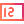
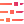

# Components Overview

Components represent the elements of your web application.

* The Builder delivers built-in components and supports the implementation of custom components.
* The built-in components are the Kendo UI components that are delivered by [Kendo UI for Angular](https://www.telerik.com/kendo-angular-ui/components/) or [Kendo UI for jQuery](https://demos.telerik.com/kendo-ui/).
* You can add, modify, use, and remove components in the [Blank]() and [App Layout]() views only.

    

        

            <h2>Charts</h2>
            
Charts allow users to visualize and output graphical representations of data.

        

        

            <ul class="card-list row">
                <li class="col-xs-4 col-md-3">
                    <a href="area-charts/" title="Area Charts">
                        
                        
Area Charts

                    </a>
                </li>
                <li class="col-xs-4 col-md-3">
                    <a href="bar-charts/" title="Bar Charts">
                        
                        
Bar Charts

                    </a>
                </li>
                <li class="col-xs-4 col-md-3">
                    <a href="donut-charts/" title="Donut Charts">
                        
                        
Donut Charts

                    </a>
                </li>
                <li class="col-xs-4 col-md-3">
                    <a href="line-charts/" title="Line Charts">
                        
                        
Line Charts

                    </a>
                </li>
                <li class="col-xs-4 col-md-3">
                    <a href="pie-charts/" title="Pie Charts">
                        
                        
Pie Charts

                    </a>
                </li>
            </ul>
        

    

    

        

            <h2>Custom Html</h2>
            
The Custom HTML components delivers options that allow you to use custom HTML to manage and modify specific elements of the web application.

        

        

            <ul class="card-list row">
                <li class="col-xs-4 col-md-3">
                    <a href="custom-html/" title="Custom Html">
                        
                        
Custom Html

                    </a>
                </li>
            </ul>
        

    

    

        

            <h2>Data Management</h2>
            
Data management components enable users to interact with data and handle data operations such as filtering, selection,
                and reordering.

        

        

            <ul class="card-list row">
                <li class="col-xs-4 col-md-3">
                    <a href="grid/" title="Grid">
                        
                        
Grid

                    </a>
                </li>
                <li class="col-xs-4 col-md-3">
                    <a href="list-view/" title="Grid">
                        
                        
List View

                    </a>
                </li>
            </ul>
        

    

    

        

            <h2>Editors</h2>
            
Editors help users to create, edit, and save files.

        

        

            <ul class="card-list row">
                <li class="col-xs-4 col-md-3">
                    <a href="auto-complete/" title="Auto Complete">
                        
                        
Auto Complete

                    </a>
                </li>
                <li class="col-xs-4 col-md-3">
                    <a href="boolean-radio-button-list/" title="Boolean Radio Button List">
                        
                        
Boolean Radio Button List

                    </a>
                </li>
                <li class="col-xs-4 col-md-3">
                    <a href="check-box/" title="Check Box">
                        
                        
Check Box

                    </a>
                </li>
                <li class="col-xs-4 col-md-3">
                    <a href="combobox/" title="Combo Box">
                        
                        
Combo Box

                    </a>
                </li>
                <li class="col-xs-4 col-md-3">
                    <a href="currency-textbox/" title="Currency Text Box">
                        
                        
Currency Text Box

                    </a>
                </li>
                <li class="col-xs-4 col-md-3">
                    <a href="datepicker/" title="Data Picker">
                        
                        
Date Picker

                    </a>
                </li>
                <li class="col-xs-4 col-md-3">
                    <a href="datetimepicker/" title="Date Time Picker">
                        
                        
Date Time Picker

                    </a>
                </li>
                <li class="col-xs-4 col-md-3">
                    <a href="disabled-textbox/" title="Disabled Text Box">
                        
                        
Disabled Text Box

                    </a>
                </li>
                <li class="col-xs-4 col-md-3">
                    <a href="dropdownlist/" title="Drop Down List">
                        
                        
Drop Down List

                    </a>
                </li>
                <li class="col-xs-4 col-md-3">
                    <a href="editor/" title="Editor">
                        
                        
Editor

                    </a>
                </li>
                <li class="col-xs-4 col-md-3">
                    <a href="email-textbox/" title="Email Text Box">
                        
                        
Email Text Box

                    </a>
                </li>
                <li class="col-xs-4 col-md-3">
                    <a href="integer-textbox/" title="Integer Text Box">
                        
                        
Integer Text Box

                    </a>
                </li>
                <li class="col-xs-4 col-md-3">
                    <a href="label/" title="Label">
                        
                        
Label

                    </a>
                </li>
                <li class="col-xs-4 col-md-3">
                    <a href="masked-textbox/" title="Masked Text Box">
                        
                        
Masked Text Box

                    </a>
                </li>
                <li class="col-xs-4 col-md-3">
                    <a href="numeric-textbox/" title="Numeric Text Box">
                        
                        
Numeric Text Box

                    </a>
                </li>
                <li class="col-xs-4 col-md-3">
                    <a href="password-textbox/" title="Password Text Box">
                        
                        
Password Text Box

                    </a>
                </li>
                <li class="col-xs-4 col-md-3">
                    <a href="percent-textbox/" title="Percent Text Box">
                        
                        
Percent Text Box

                    </a>
                </li>
                <li class="col-xs-4 col-md-3">
                    <a href="percent-value-textbox/" title="Percent Value Text Box">
                        
                        
Percent Value Text Box

                    </a>
                </li>
                <li class="col-xs-4 col-md-3">
                    <a href="phone-textbox/" title="Phone Text Box">
                        
                        
Phone Text Box

                    </a>
                </li>
                <li class="col-xs-4 col-md-3">
                    <a href="radio-button-list/" title="Radio Button List">
                        
                        
Radio Button List

                    </a>
                </li>
                <li class="col-xs-4 col-md-3">
                    <a href="slider/" title="Slider">
                        
                        
Slider

                    </a>
                </li>
                <li class="col-xs-4 col-md-3">
                    <a href="textarea/" title="Text Area">
                        
                        
Text Area

                    </a>
                </li>
                <li class="col-xs-4 col-md-3">
                    <a href="textbox/" title="Text Box">
                        
                        
Text Box

                    </a>
                </li>
                <li class="col-xs-4 col-md-3">
                    <a href="timepicker" title="Time Picker">
                        
                        
Time Picker

                    </a>
                </li>
                <li class="col-xs-4 col-md-3">
                    <a href="url-textbox" title="Url Text Box">
                        
                        
Url Text Box

                    </a>
                </li>
            </ul>
        

    

    

        

            <h2>Layout</h2>
            
Layout components create an intuitive layout of web projects and provide for an easier navigation.

        

        

            <ul class="card-list row">
                <li class="col-xs-4 col-md-3">
                    <a href="row" title="Row">
                        
                        
Row

                    </a>
                </li>
                <li class="col-xs-4 col-md-3">
                    <a href="col" title="Col">
                        
                        
Col

                    </a>
                </li>
            </ul>
        

    

    

        

            <h2>Media</h2>
            
Media components display visual or dynamic content in a user-friendly way.

        

        

            <ul class="card-list row">
                <li class="col-xs-4 col-md-3">
                    <a href="image" title="Image">
                        
                        
Image

                    </a>
                </li>
            </ul>
        

    

    

        

            <h2>Navigation</h2>
            
Navigation components display data in a particular, usually hierarchical, order so that it is easier to trace
                the relations between the data.

        

        

            <ul class="card-list row">
                <li class="col-xs-4 col-md-3">
                    <a href="button/" title="Button">
                        
                        
Button

                    </a>
                </li>
                <li class="col-xs-4 col-md-3">
                    <a href="expander/" title="Expander">
                        
                        
Expander

                    </a>
                </li>
                <li class="col-xs-4 col-md-3">
                    <a href="tab-strip/" title="Tab Strip">
                        
                        
Tab Strip

                    </a>
                </li>
                <li class="col-xs-4 col-md-3">
                    <a href="toolbar/" title="Toolbar">
                        
                        
Tool Bar

                    </a>
                </li>
            </ul>
        

    

    

        

            <h2>Site</h2>
            
Site components provide options for designing the layout of the web application on generic level and are available in the <a href="">App Layout</a> view only.

        

        

            <ul class="card-list row">
                <li class="col-xs-4 col-md-3">
                    <a href="" title="Languages Drop Down">
                        
                        
Languages Drop Down

                    </a>
                </li>
                <li class="col-xs-4 col-md-3">
                    <a href="" title="Navigation Panel Bar">
                        
                        
Navigation Panel Bar

                    </a>
                </li>
                <li class="col-xs-4 col-md-3">
                    <a href="tab-strip/" title="User Drop Down">
                        
                        
User Drop Down

                    </a>
                </li>
            </ul>
        

    

    

        

            <h2>Schedulers</h2>
            
Schedulers display and help users to manage tasks and appointments.

        

        

            <ul class="card-list row">
                <li class="col-xs-4 col-md-3">
                    <a href="calendar/" title="Calendar">
                        
                        
Calendar

                    </a>
                </li>
            </ul>
        

    

## Suggested Links

* [Custom Components]()
* [Blank View]()
* [App Layout View]()
* [Kendo UI for Angular Documentation](https://www.telerik.com/kendo-angular-ui/components/)
* [Kendo UI for jQuery Documentation](https://docs.telerik.com/kendo-ui/introduction)
* [Kendo UI for jQuery Demos](https://demos.telerik.com/kendo-ui/)
