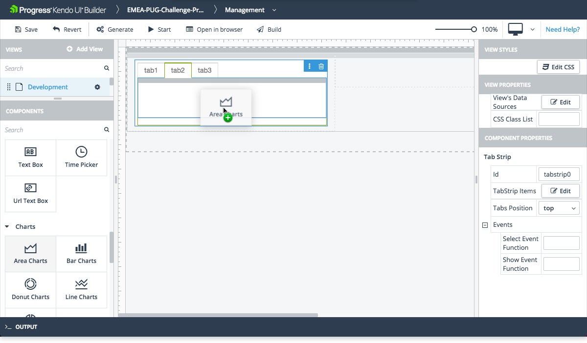

# Tab Strip

The Tab Strip is part of the Navigation components which the Builder supports.

## Usage

* Represents a collection of tabs with associated content.
* Enables users to switch between different tab views inside a single component.
* To add tabs to a tab strip, see the TabStrip Items property described below. To add contents to an existing tab:
    * Select the tab from the tab strip by its label text in the drop-down menu beside its trash icon. The selected tab opens.
    * Drag at least one layout row to the tab, then drag additional components into that row, or into other rows that you have added to the tab. It following the [Blank view layout rules](#toc-layout).

## Preview

## Properties of Interest

* **TabStrip Items**&mdash;Click Edit to add or remove tabs in the tab strip.
* **Events**
    * **Select Event Function**&mdash;Fired when the user selects a tab in the tab strip.
    * (AngularJs only)**Show Event Function**&mdash;Fired when the selected tab displays its contents.
    > You have to include any custom code for this event function in the `controller.public.js` file for AngularJS or in the `[view-name].view.component.ts` file for Angular which are located in the `\app\src\modules\[module-name]\[view-name]` folder. For more information, refer to the article on [custom code]().

## Suggested Links

* [Kendo UI TabStrip for Angular](https://www.telerik.com/kendo-angular-ui/components/layout/tabstrip/)
* [Kendo UI TabStrip for jQuery](https://demos.telerik.com/kendo-ui/button/index)
* [Kendo UI Builder Components]()
