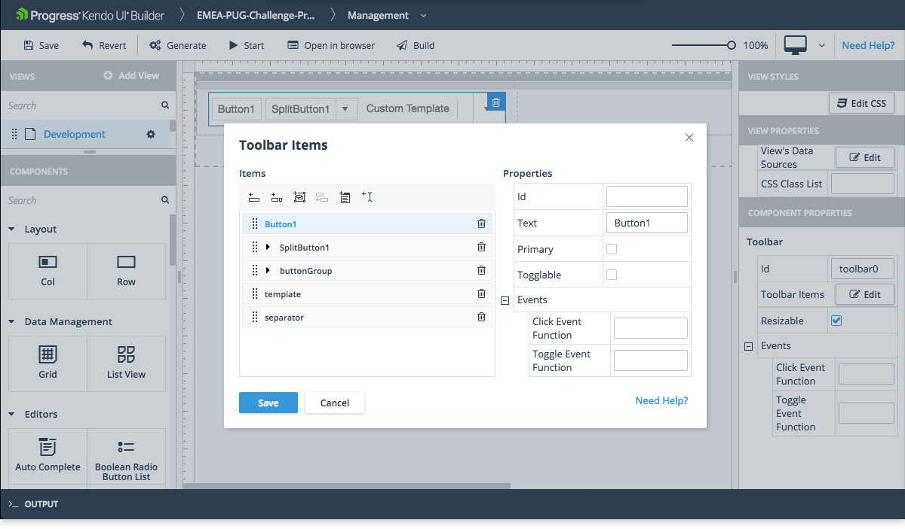

# Tool Bar

The Tool Bar is part of the Navigation components which the Builder supports.
> The Builder supports Tool Bar components only for AngularJs application.

## Usage

* Represents a graphical element for holding input elements.
* Provides different types of items, such as buttons, toggle buttons, split buttons, button groups, and other customized elements.

## Preview

## Properties of Interest

* **Toolbar Items**&mdash;Click Edit to open an advanced editor window where you can add or remove items on the toolbar.
* **Events**
    * **Click Event Function**&mdash;Fired when the user clicks a button in the toolbar.
    * **Toggle Event Function**&mdash;Fired when the user toggles a button in the toolbar.

    > You have to include any custom code for this event function in the `controller.public.js` file for AngularJS or in the `[view-name].view.component.ts` file for Angular which are located in the `\app\src\modules\[module-name]\[view-name]` folder. For more information, refer to the article on [custom code]().

## Suggested Links

* [Kendo UI Toolbar for jQuery](https://demos.telerik.com/kendo-ui/toolbar/index)
* [Kendo UI Builder Components]()
