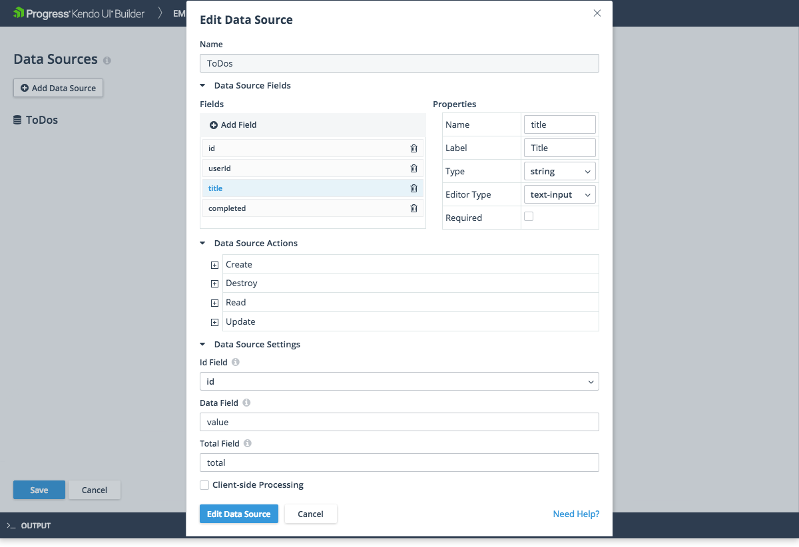

# Generic REST Data Source

The REST Data Provider does not support the consuming of service metadata or a schema and you have to manually add and configure all fields and properties.

When you add or edit fields, you have to specify their name, label and type, and based on the selected type to choose the right editor for your filed.

To define the supported data source actions, click **Data Source Actions** to display an expandable list of the **Create**, **Destroy**, **Read**, and **Update** actions. For all actions you can specify their:
* **Type**&mdash;Select the REST verb for the action. For example, the default verb for the **Create** action is **POST**.
* **URL**&mdash;Enter the URI for the action object that is relative to the Base URI which is specified for the data provider.

The REST data source provides some specific settings which are helpful when the endpoint returns or expects the data in a different way:

* **Id Field**&mdash;Select a data source field that functions as a primary key to the data source by using the drop-down list.
* **Data Field**&mdash;Represents a field in the server response that returns one or more rows to the data source.
* **Total Field**&mdash;Represents a field in the server response that contains the total number of rows which are returned in the response.
* **Client-side processing**&mdash;Indicates whether the application will retrieve all or paged data from the endpoint. If the server-side operations are used, the data source uses the value which is returned by the **Total** field to manage the paging of data on the server.

## Suggested Links

* [Adding OData Endpoints]()
* [Adding Generic REST Endpoints]()
* [Adding Progress Data Endpoints]()
* [Overview of the Kendo UI DataSource Component](https://docs.telerik.com/kendo-ui/framework/datasource/overview)
