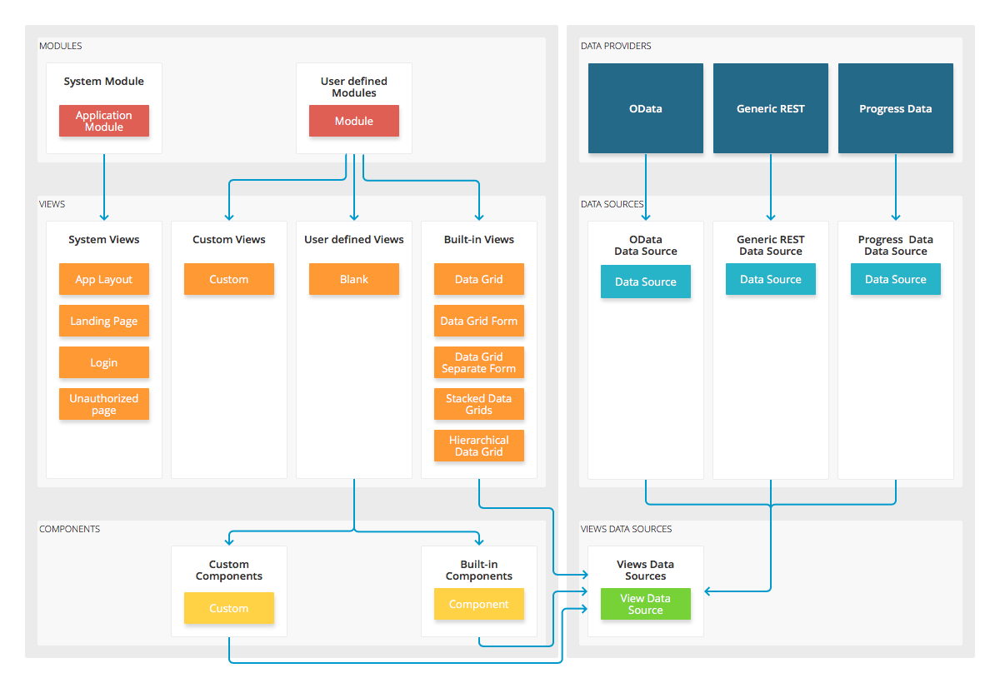

# Introduction to Kendo UI Builder

Kendo UI® Builder by Progress® is a tool for creating and managing high-performance, responsive web applications which support the implementation of Kendo UI components.

## Overview

* Utilizes the contemporary HTML, CSS, and JavaScript technologies.
* Separates the user interface (UI) from the project business logic which runs on the application server.
* Provides extension points for customizing the functional units of the web project.
* Delivers access to predefined visual components for easily setting up the layout and content of the web application.
* Saves a significant amount of efforts and time otherwise needed for web development.

## Supported Frameworks

* Angular
* AngularJS

## Styles

* Use the [predefined Kendo UI themes](), or
* Import a custom theme created with the [Progress® Sass Theme Builder](http://themebuilder.telerik.com/).

## Progress OpenEdge® Integration

* [Official Progress® Software Documentation](https://www.progress.com/documentation/kendo-ui-builder).  
* [Developing a Progress OpenEdge Web App Using Kendo UI Builder](https://www.progress.com/services/education/openedge/developing-an-openedge-web-app-using-kendo-ui-builder).  

## Building Blocks

* [Modules, views, and components](#toc-modules-views-and-components)
* [Data providers](#toc-data-providers)
* [Extension points](#toc-extension-points)

### Modules, Views, and Components

The modules are the functional units of the web application.
* Each module represents a collection of views.
* With the creation of each new application, the Builder provides the built-in [App Module]() which contains predefined, system views.
* While you build your web application, you can add, modify, and remove the modules your project requires.

For more information on handling the module settings, refer to the article on [designing the application](#toc-module-settings). For more information on the module functionalities, refer to the documentation on [modules]().

The views are part of the modules and provide the settings that are available for each page of the web application.

* The [system views](#toc-system) are built-in views which are delivered with the App Module.
* The [built-in views](#toc-predefined) offer a predefined layout. They aim at facilitating the implementation of the most common scenarios.
* The [user-defined view](#toc-blank) is the Blank view. It provides options for adding, editing, and removing the predefined and custom components, and allows you to modify its layout and functionalities according to the requirements of your business project.  
* The Builder also allows you to implement [custom views]() in your web project.

The components can be used in the Blank view only.  

* The [built-in components]() offer a predefined set of functionalities. Based on the similar features they deliver, the components are grouped into subsets such as Data Management or Layout components.
* The Builder also allows you to implement [custom components]() in your web project.  

### Data Providers

The data providers handle the data connectivity of the application by supporting the input of third-party or custom service endpoints by utilizing the available [data sources]().

### Extension Points

The extension points enable you to customize specific aspects of the generated web project.

* [Custom CSS]()&mdash;The CSS extension points deliver options for personalizing the styles of the web application.
* [Custom code]()&mdash;The code extension points provide options for modifying the backend of the application.  
* [Custom components]()&mdash;The component extension points allow you to update the components according to the specific requirements of your project.
* [Custom packages]()&mdash;The package extension points help you modify the bundles and packages of the generated application.
* [Custom themes]()&mdash;The theme extension points enable you to apply tailor-made decisions regarding the appearance of the application.  
* [Custom views]()&mdash;The view extension points handle the customization of the web application views.
* [Extending the head]()&mdash;You can add custom elements, such as custom code or links, to the head of the generated web project.

## Suggested Links

* [Installing the Kendo UI Builder]()
* [Modules]()
* [Views]()
* [Components]()
* [Data Providers]()
* [Extension Points]()
* [Frameworks]()
