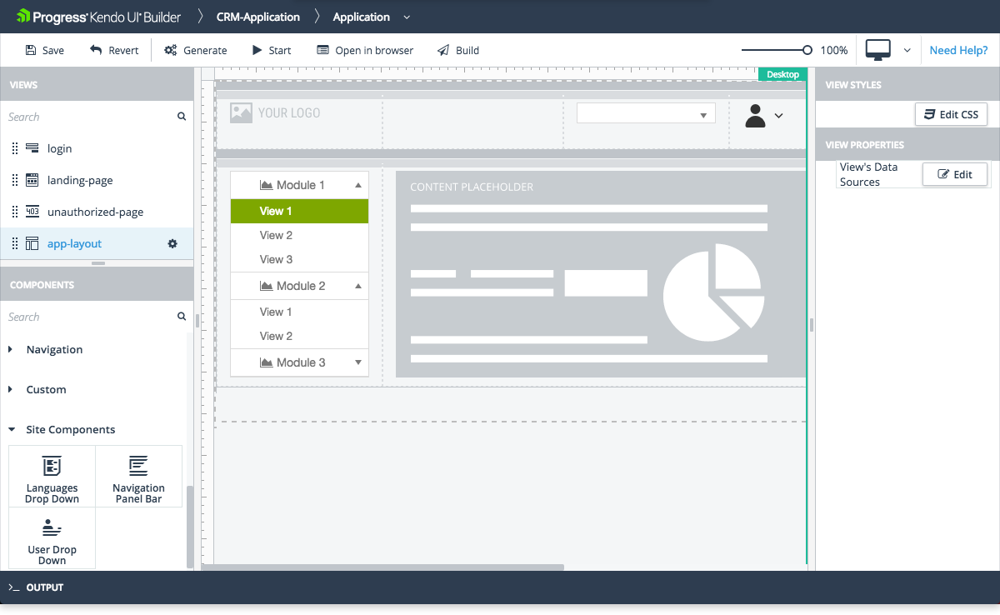

# App Layout View

The App Layout view is one of the system views which the [Application Module]() provides by default.

## Features

* Represents the layout of the whole application.
* Possess all functionalities of [Blank View]() including some additional layout components.
* Contains added by defautl Content Placeholder component, which is the place where other views are loeaded runtime.
* Provides options for adding, modifying, and removing rows and columns.
* Contains collection of datasources which can be used for loading data in databound components.
* Delivers the [Site components](#toc-site) and provides options for adding, modifying, and removing them within the view.

* Supports the update of its properties. For more information on the specific settings that are subject to modification, refer to the right-hand vertical toolbar (property grid) of the view.

## Preview

## Suggested Links

* [Views]()
