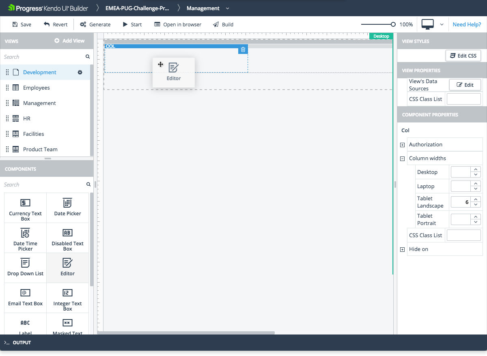
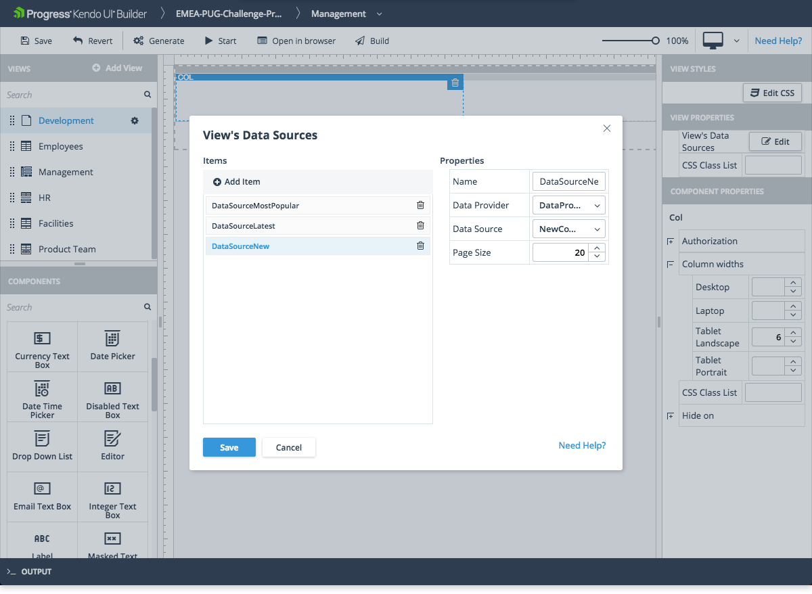

# Blank View

The Blank view is the user-defined view that is provided by the Builder.

## Features

* Represents an empty view which enables you to define a custom functionality and layout.
* Allows you to specify multiple data sources.
* Supports the creation of responsive layout by dragging and dropping rows and columns.
* Provides options for adding, modifying, and removing the [built-in]() or [custom components]() within the view.

## Preview

## Data Binding

Due to its specifics, the Blank view provides certain approaches for data binding and defining its data sources.  

### Blank View Data Sources

To start working with a Blank view, you need to define data source instances for it which you can later bind to most of its components. The definition of the data source instances is done based on one or more of the existing data sources that are defined for the application data providers. From the **View Properties** pane, add and review the desired data source instances which will be used in the Blank view.

### Using Data Source Instances

A data source is used with components that work with a set of records. A model (or data model) is used to represent the values of a single data source record. The Builder automatically creates a data model for every data source instance which is created for a view. When a component works with a data model, the binding is two-way, and the UI and the data are always in sync. For example, to create a view with a grid and a form, the grid is bound to the data source and the form fields are “bound” through their data model. When a row is selected in the grid, the framework automatically copies the values from the data source into the data model of the same name, so that the currently selected record is shown in the form.

Every component that works with data has a **Model** property which points to the name of the model created over the data-source definition and runtime is represented by a record of the data source. Most of these model-bound components have two fields to specify their **Model** property&mdash;one field to specify the data model itself and a second field to specify the field from that model whose value the editor displays or updates. In addition, the list components also have the option to specify a single field from their model to represent the value of the component. They all have a **Value Primitive** checkbox property which, when selected, provides a two-field **Model** property similar to other model-bound editor components to select both the data model and its value field&mdash;for example, the Drop Down List component.

## Layout

The Blank view supports a responsive layout that draws from [Bootstrap Grid](https://getbootstrap.com/docs/4.0/layout/grid/) for different screen sizes which are based on the display type.

The view provides the following display types:

* **Desktop**
* **Laptop**
* **Tablet Landscape**
* **Tablet Portrait**

The two basic layout elements in the Blank view are rows and columns. You can drag and drop these elements from the **Components** palette:

* Row&mdash;Rows act as containers for columns and allow only columns to be dropped to them.
* Column&mdash;Once a row is added, you can drag and drop one or more columns into that row. The columns allow the dropping of rows or other components to them, but you are not allowed to drop columns to columns. You can delete columns and their contents by clicking on the thick top border and then the **Trash can** icon. When you select a column, you can edit its properties.

The most important available layout features are:

* Column width&mdash;You can specify or change the column width (column span) for each screen size. There are 12 available column slots in each row. A column can occupy one or more slots. For example, you can have 12 columns that span one slot each, or three columns that span four slots each.

  > Unless you enter a different width for the Desktop, Laptop, and Tablet Portrait screen sizes, the required Tablet Landscape width will be used for all screen sizes.

* Hide on&mdash;You can hide a column on a given screen size by selecting the checkbox for that screen width. You can use this feature to provide more details on larger screens while minimizing the content that is shown for smaller devices.

> * If you have not already dragged and dropped a column, dragging any other component to a row automatically creates a column for it.
> * To view the results of any layout changes, use the display type preview at the top right of the toolbar.

## Components

The Blank view offers a variety of data management, editing, scheduling, and charting components. For the full list of components, refer to the [component overview]().

Similar to the predefined views, the Blank view provides the option for a custom section where you can add your own custom HTML code. For Angular, the Builder generates this file in the `\app\src\app\modules\[module-name]\[view-name]\` folder. For AngularJS, the Builder generates this file in the `\app\src\modules\[module-name]\[view-name]\` folder. Add your custom HTML code to the generated file, which is used to add template code for the **Template** properties of content components added to the **Blank View**.

> Unlike the custom section files that are generated for the predefined views, none of the HTML content that is added to the `topSection.html` file of the Blank view is visible in the view.

## Suggested Links

* [Views]()
