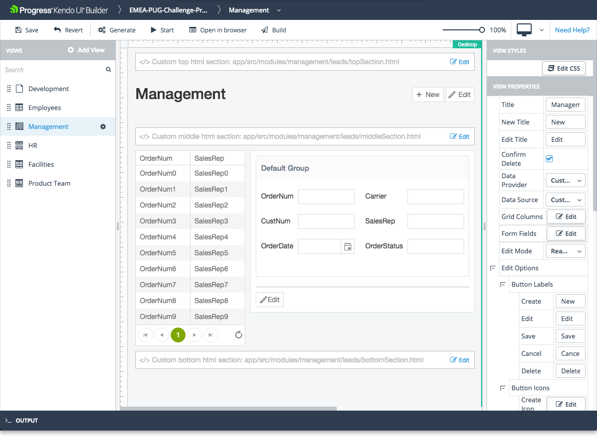
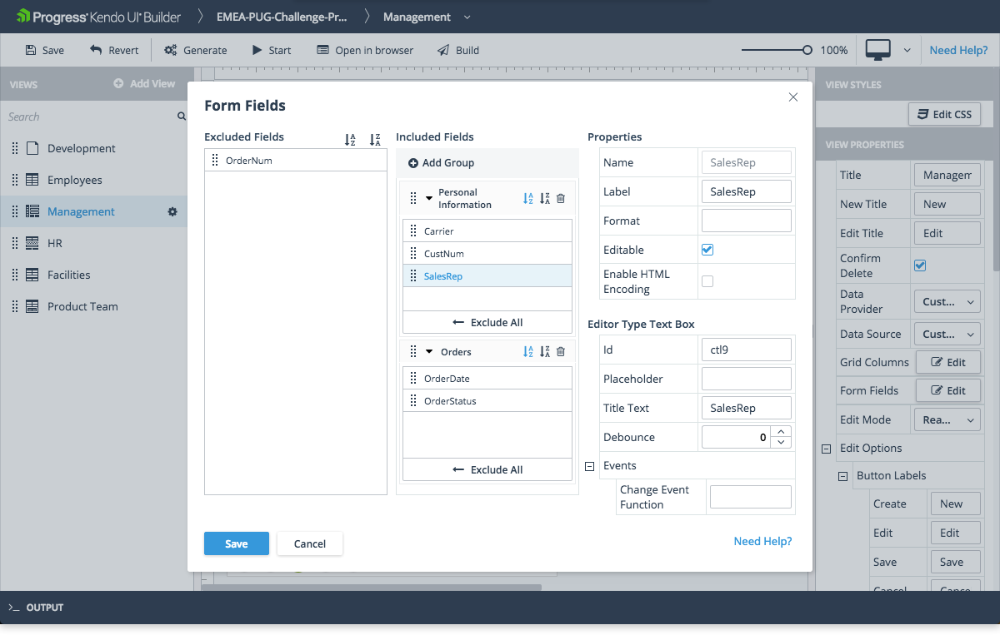

# Data Grid Form View

The Data Grid Form view is one of the built-in views that are provided by the Builder for facilitating common use-case scenarios.

## Features

* Represents a Grid component with a data-driven form for CRUD operations. When the user makes a selection in the Grid, the model of the form is updated accordingly.
* The ratio between the Grid and the form is 2:3.
* Supports editing for the selected item. To enable the feature, either set the **Read-Only-to-Editing** mode, which is `true` by default, or use the data form as a detail view in read-only mode by selecting the **Read-Only** edit mode.
* Supports error handling.
* Allows you to set and edit its basic functionalities. For more information on the settings that are subject to modification, refer to the right-hand vertical toolbar (property grid) of the view.

The view also includes custom sections where you can include your own HTML. Each section is identified in the view design page with a placeholder which contains descriptive text.

* Custom top HTML section&mdash;Located in the area above **Header Title**.
* Custom middle HTML section&mdash;Located in the area below **Header Title** and above **Grid** and **Data Form**.
* Custom bottom HTML section&mdash;Located in the area below **Grid** and **Data Form**.

The Builder automatically generates these files in the `\app\src\modules\[module-name]\[view-name]\` folder and you need to add your custom HTML code to these files. The **Edit** option on each custom HTML section allows you to edit the corresponding file from within the Builder.

## Preview

## Properties of Interest

* **Data Provider**&mdash;Represents a drop-down with all data providers added to the application.
* **Data Source**&mdash;When you select a data provider, the data source drop-down is automatically populated with all available data sources for the specific provider. Based on that metadata, the Grid columns and all form fields are automatically populated. Later on you can change the column properties or form field properties of the Grid by using the corresponding **Edit Columns** and **Edit Form Fields** options.

  > Since the Data Grid Form view contains a Grid component, all properties of the Grid component are also available in the Data Grid Form view. For more information on specific Grid properties, refer to the article on the [Grid component]().

* **Form Fields**&mdash;Provides options to change certain properties of the fields that are displayed in the form:

    * You can use the **Include all** and **Exclude all** buttons to move the entire list of fields back and forth between the **Included Fields** and **Excluded Fields** lists.
    * By default, all fields are placed in one field group with the default label. To change the label, click the group item, which displays the **Name** property, and enter a new label value under **Properties**. To add one or more field groups to the **Included Fields** list with the default label, use the **+ Add Group** button. To populate a field group, click the `Down arrow` on the group item to open it and drag and drop the desired fields from one field group to another open field group. At runtime, field groups are displayed as tab folders on the form.
    * When you select a field item in the **Included Fields** list, you can view or set the following properties:
        * **Label Text**&mdash;Represents a field label that you can change from the default, which is the Label set for the selected field in the view data source.
        * **Field Name**&mdash;Represents a read-only name of the selected field in the list.
        * **Format**&mdash;Can be used to customize the way the field is rendered. Use the `{0}` argument to represent the content of the field. You can also add additional text for display. For more information on number and date formatting options, refer to the articles on [AngularJS number formatting](http://docs.telerik.com/kendo-ui/framework/globalization/numberformatting), [AngularJS date formatting]( http://docs.telerik.com/kendo-ui/framework/globalization/dateformatting), and [Angular formatting](https://www.telerik.com/kendo-angular-ui/components/internationalization/parsing-and-formatting/).
        * You can also set additional properties and events under **Editor Type** which represent properties and events for the specified editor type. Since the underlying components of the form fields are the same as the components in the Blank View, for specific property usage and configuration, refer to the documentation on [components]().

## Suggested Links

* [Views]()
