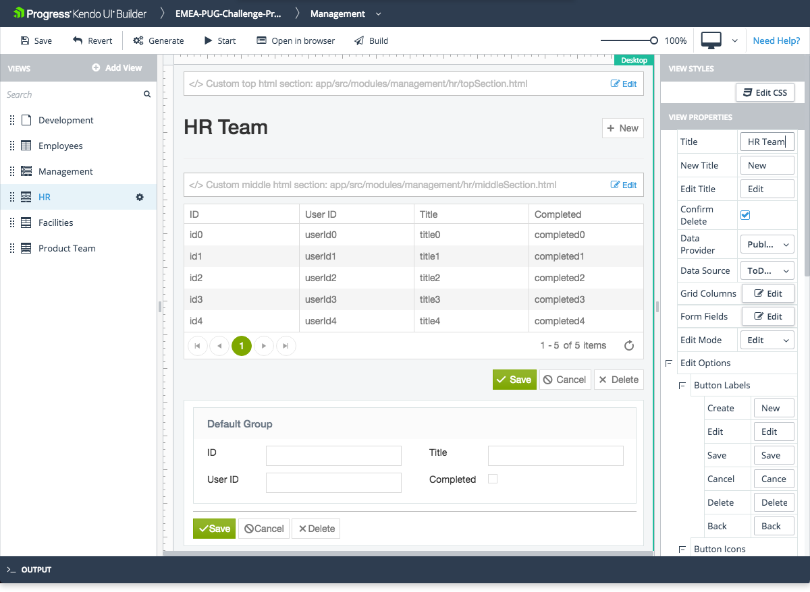

# Data Grid Separate Form View

The Data Grid Separate Form view is one of the built-in views that are provided by the Builder for facilitating common use-case scenarios.

## Features

* Represents a Grid component with a data-driven form. When the user makes a selection in the Grid, it is hidden and on tis place a data-form is shown with selected model from the grid item.
* The ratio between the Grid and the form field is 1:1&mdash;when the Grid is open, the form field is hidden and vice versa.
* Supports CRUD (create, read, update, and delete) data operations.
* Supports editing for the selected item by setting the **Edit Mode** property to the **Edit**, which is set by default, or to the **Read-Only-to-Edit** mode. To use the data form as a detail view in the read-only mode, select the **Read-Only** edit mode.
    * **Edit**&mdash;When the Grid row is selected, the data form is displayed in the edit mode and all its corresponding editors are rendered.
    * **Read-Only-to-Edit**&mdash;When the Grid row is selected, the data form is displayed in the read-only mode. However, the **Edit** / **New** buttons are rendered above and below the form, so that the user can set the form in the edit mode.

> For more information on specific Data Grid Separate Form view properties, refer to the article on the [Grid Form view]().

## Preview

## Suggested Links

* [Views]()
