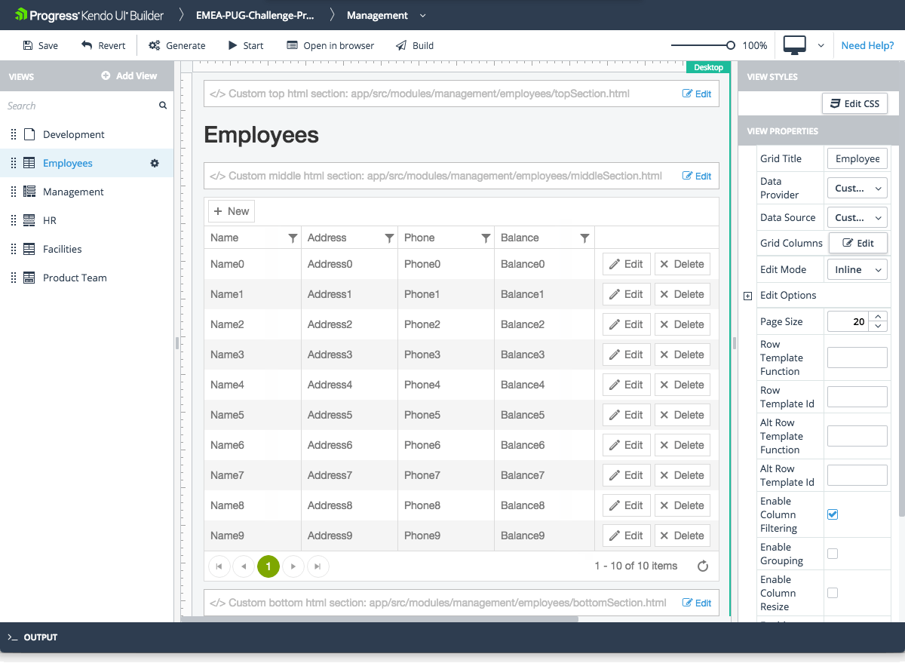

# Data Grid View

The Data Grid view is one of the built-in views that are provided by the Builder for facilitating common use-case scenarios.

## Features

* Represents a Grid component with a title and top, middle, and bottom sections.
* Supports CRUD (create, read, update, and delete) data operations.
* Supports editing through the **Incell**, **Inline**, and **Popup** modes.
* Supports error handling.
* Allows you to set and edit its basic functionalities. For more information on the settings that are subject to modification, refer to the right-hand vertical toolbar (property grid) of the view.

The view also includes custom sections where you can include your own HTML. Each section is identified in the view design page with a placeholder containing descriptive text:

* Custom top HTML section&mdash;Located in the area above **Header Title**.
* Custom middle HTML section&mdash;Located in the area below **Header Title** and above **Grid**.
* Custom bottom HTML section&mdash;Located in the area below **Grid**.

The Builder automatically generates these files in the `\app\src\modules\[module-name]\[view-name]\` folder and you need to add your custom HTML code to these files. The **Edit** option on each custom HTML section allows you to edit the corresponding file from within the Builder.

## Preview

## Specific Properties

* **Data Provider**: A drop down with all data providers added to the application.
* **Data Source**: When you select a data provider the datasource dropdown will be automatically populated with all avalalbe datasources for this provider.

> Since the grid-view has a grid component into it all properties from the grid component are also exposed. For more information about specific grid properties see [grid component]().

## Suggested Links

* [Views]()
