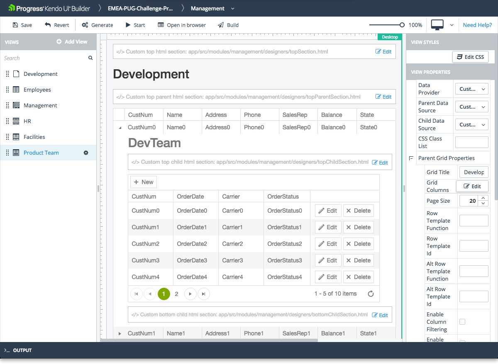

# Hierarchical Data Grid View

The Hierarchical Data Grid view is one of the built-in views that are provided by the Builder for facilitating common use-case scenarios.

## Features

* Represents a Grid component with child grids. The child grids become visible when the users expand a row of the parent Grid.
* Supports CRUD (create, read, update, and delete) data operations only for the child grid.
* Supports editing for the child grids through the **Incell**, **Inline**, and **Popup** modes.
* Supports error handling.
* Allows you to set and edit its basic functionalities. For more information on the settings that are subject to modification, refer to the right-hand vertical toolbar (property grid) of the view.

> In order for the Hierarchical Data Grids view to work properly, the data sources to which you bind the hierarchical grids need to be related. For more information, refer to the articles on [data providers]().

The view also includes custom sections where you can include your own HTML. Each section is identified in the view design page with a placeholder which contains descriptive text.

* Custom top HTML section&mdash;Located in the area above **Header Title**.
* Custom top parent HTML section&mdash;Located in the area below the **Parent Grid Title** but above **Parent Grid**.
* Custom top child html section&mdash;Located in the area below the **Child Grid Title** but above **Child Grid**.
* Custom bottom child html section&mdash;Located in the area below the **Child Grid**.
* Custom bottom HTML section&mdash;Located in the area below **Parent Grid**.

For Angular, the Builder generates these files in the `\app\src\app\modules\[module-name]\[view-name]\` folder. For Angular JS, the Builder generates these files in the `\app\src\modules\[module-name]\[view-name]\` folder. Add your custom HTML code to the generated files and use the **Edit** option on each custom HTML section to edit the corresponding file from within the Builder.

## Preview

## Properties of Interest

* **Data Provider**&mdash;Represents a drop-down with all the data providers that are added to the application.
* **Parent Data Source**&mdash;When you select a data provider, the data source drop-down is automatically populated with all the hierarchical parent data sources that are available for the selected data provider.
* **Child Data Source**&mdash;When you select a data provider, the data source drop-down is automatically populated with all the hierarchical child data sources that are available for the selected data provider.

> * If the data provider does not contain related data sources, **Parent Data Source** and **Child Data Source** will be empty.
> * Since the Hierarchical Data Grid view contains a Grid component, all properties of the Grid component are also available in the Hierarchical Grid view. For more information on specific Grid properties, refer to the article on the [Grid component]().

## Suggested Links

* [Views]()
