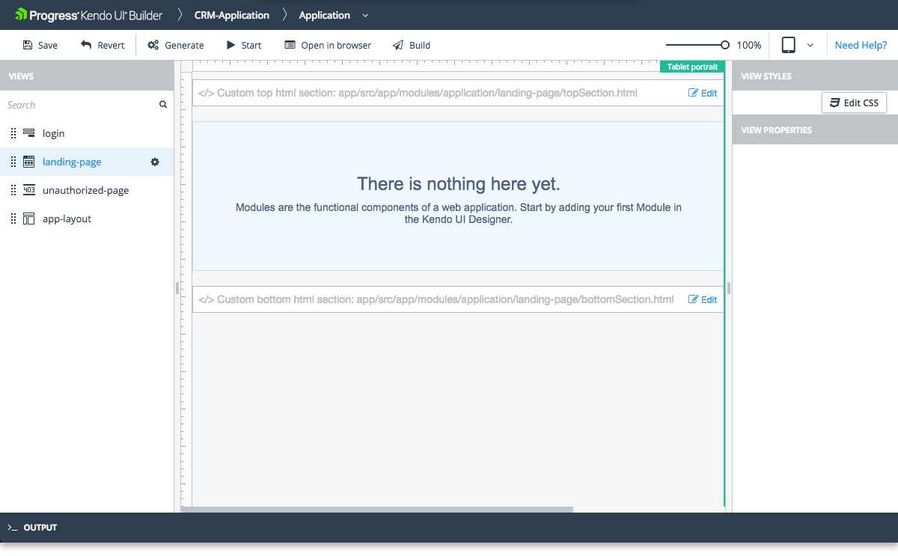

# Landing Page View

The Landing Page view is one of the system views which the [Application Module]() provides by default.

## Features

* Represents the layout of the web page that will load when the user clicks a search engine optimized result or an online advertisement.
* Lists all modules inside its content.
* Allows you to apply different styles to the view content by clicking the **Edit CSS** button and writing your own custom styles in the opened editor.

The view also includes custom sections where you can include your own HTML. Each section is identified in the view design page with a placeholder which contains descriptive text.

* Custom top HTML section&mdash;Located in the area above **Content** with the list of modules.
* Custom bottom HTML section&mdash;Located in the area below **Content**.

The Builder automatically generates these files in the `\app\src\modules\application\landing-page` application folder and you need to add your custom HTML code to these files. The **Edit** option on each custom HTML section allows you to edit the corresponding file from within the Builder.

## Preview

## Suggested Links

* [Views]()
