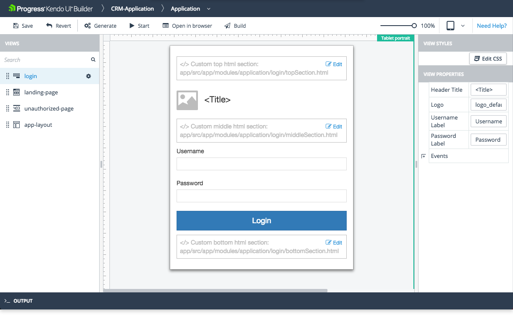

# Login View

The Login view is one of the system views which the [Application Module]() provides by default.

## Features

* Represents the layout of the page where the users submit their credentials and access the application according to their defined user roles. For more information, refer to the articles on [authentication, user roles, and authorization]().
* Allows you to edit some of its properties. For more information on which properties are subject to modification, refer to the right-hand vertical toolbar (property grid) of the view.
* View events:
    * Login Event Function: The name of a function that runs when the user clicks the Login button (default: onLogin). Any custom code for this event function must be included in the controller.public.js(AngularJS) or login.view.component.ts(Angular) file located in application-folder\app\src\modules\application\login folder. For more information, refer to the article on [Extension Points]().

The view also includes the following custom sections where you can include your own HTML. Each section is identified in the view design page with a placeholder containing descriptive text:
* Custom top html section: Located in the area above the Header Title
* Custom middle html section: Located in the area below the Header Title but above the Username Label
* Custom bottom html section: Located in the area below the Password Label

The Designer automatically generates these files for you in application-folder\app\src\modules\aspplication\unauthorized-page. Add your custom HTML code to these files as required. The Edit option on each custom HTML section allows you to edit the corresponding file from within the Designer.

## Preview

## Suggested Links

* [Views]()
