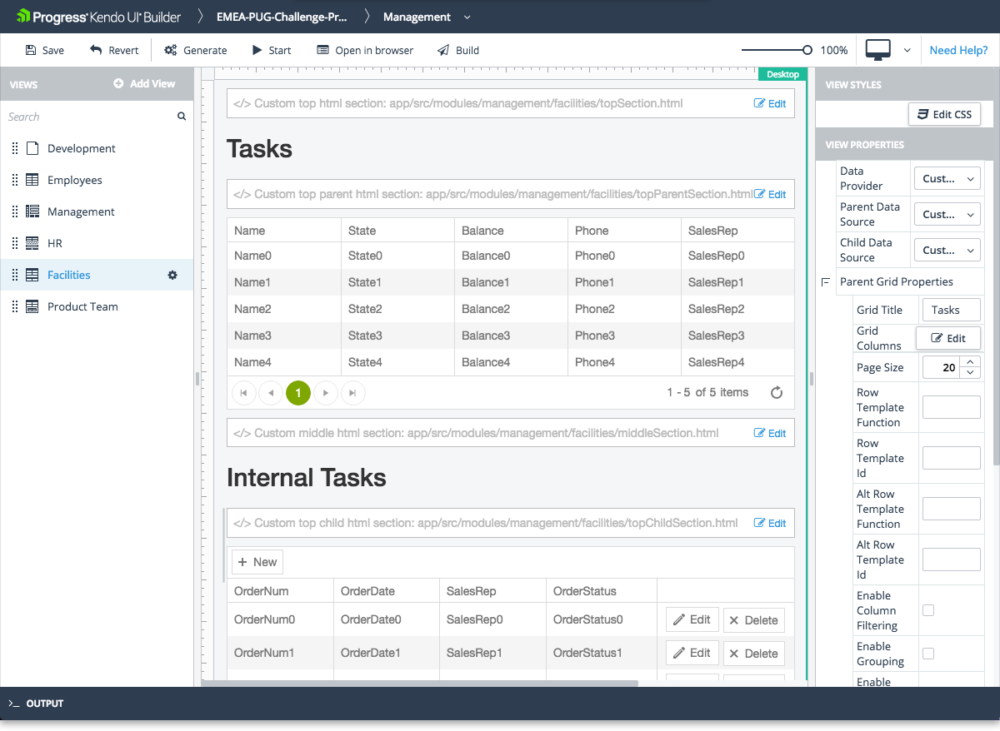

# Stacked Data Grids View

The Stacked Data Grids view is one of the built-in views that are provided by the Builder for facilitating common use-case scenarios.

## Features

* Represents a master-detail Grid component. The child grids are always visible and the selection is always persisted.
* Supports CRUD (create, read, update, and delete) data operations only for the child grid.
* Supports editing for the child grids through the **Incell**, **Inline**, and **Popup** modes.
* Supports error handling.
* Allows you to set and edit its basic functionalities. For more information on the settings that are subject to modification, refer to the right-hand vertical toolbar (property grid) of the view.

> In order for the Stacked Data Grids view to work properly, the data sources to which you bind the stacked grids need to be related. Otherwise, the stacked grids will not render the data. For more information, refer to the articles on [data providers]().

The view also includes custom sections where you can include your own HTML. Each section is identified in the view design page with a placeholder containing descriptive text:

* Custom top HTML section&mdash; Located in the area above **Header Title**.
* Custom top parent HTML section&mdash; Located in the area below the **Parent Grid Title** but above the parent grid itself.
* Custom middle HTML section&mdash; Located in the area below the **Parent Grid** and above the **Child Grid Title**.
* Custom top child html section&mdash; Located in the area below the **Child Grid Title** but above the **Child Grid** itself
* Custom bottom HTML section&mdash; Located in the area below **Child Grid**.

The Builder automatically generates these files in the `\app\src\modules\[module-name]\[view-name]\` folder and you need to add your custom HTML code to these files. The **Edit** option on each custom HTML section allows you to edit the corresponding file from within the Builder.

## Preview

## Specific Properties

* **Data Provider**: A drop down with all data providers added to the application.
* **Parent Data Source**: When you select a data provider the data-source dropdown will be automatically populated with all available hierarchical parent data-sources for the selected **Data Provider**.
* **Child Data Source**: When you select a data provider the data-source dropdown will be automatically populated with all available hierarchical child data-sources for the selected **Data Provider**.

> If the provider does not contain related data-sources the **Parent Data Source** and **Child Data Source** will be empty.

> Since the **Stacked Grid View** has a parent and child grid components into it all properties from the **Grid** component are also exposed. For more information about specific grid properties see [grid component]().

## Suggested Links

* [Views]()
