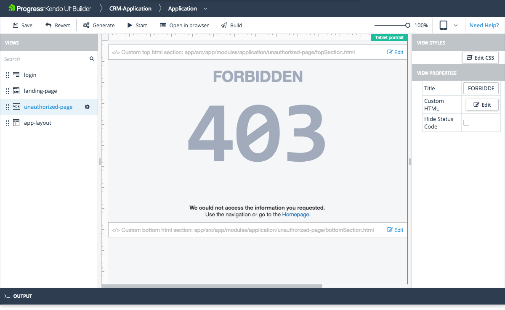

# Unauthorized View

The Unauthorized view is one of the system views which the [Application Module]() provides by default.

## Features

* Represents the layout of the page that loads when the users try to access any content that is outside their defined access rights. For more information, refer to the articles on [authentication, user roles, and authorization]().
* Allows you to set and edit its basic functionalities. For more information on which properties are subject to modification, refer to the right-hand vertical toolbar (property grid) of the view.

The view also includes custom sections where you can include your own HTML. Each section is identified in the view design page with a placeholder containing descriptive text:

* Custom top HTML section&mdash;Located in the area above the **Title** text.
* Custom bottom HTML section&mdash;Located in the area below the **Custom HTML** text.

The Builder automatically generates these files in the `app\src\modules\application\unauthorized-page` application folder and you need to add your custom HTML code to these files. The **Edit** option on each custom HTML section allows you to edit the corresponding file from within the Builder.

## Preview

## Suggested Links

* [Views]()
